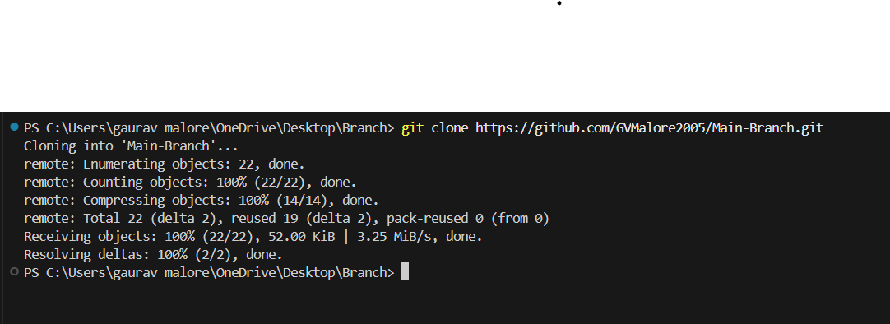

In this session, I learned the fundamentals of using Git and GitHub for version control and collaborative development. I began by creating and navigating project folders using mkdir and cd commands. I then initialized a Git repository using git init, which allowed me to track changes in my code. I learned how to stage specific files with git add and how to check the current status using git status. Committing changes with git commit -m helped me understand how to save progress with descriptive messages. I also learned to connect my local repository to a remote GitHub repository using git remote add origin and renamed the default branch using git branch -M. Finally, I pushed my code online with git push origin, making my work accessible through GitHub. This session taught me how to manage and share code efficiently, making it an essential step in professional software development workflows.

