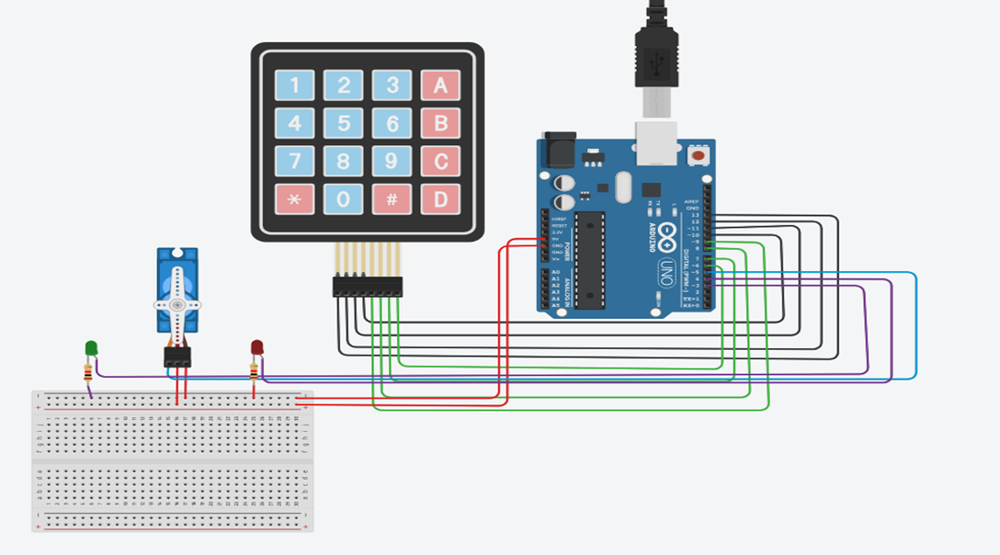
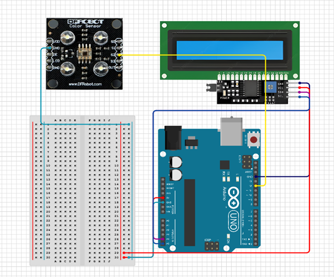
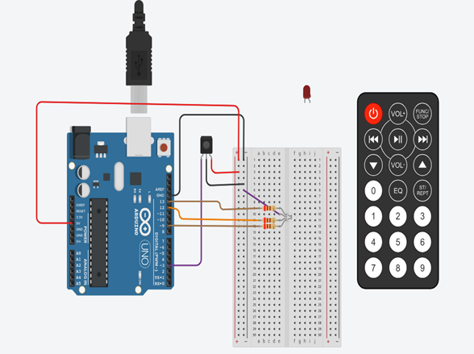
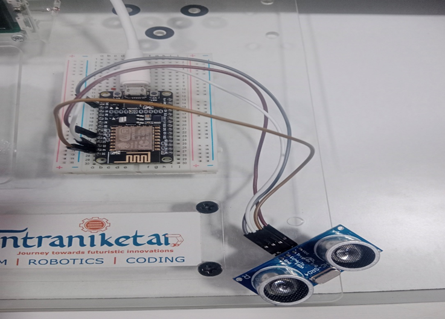
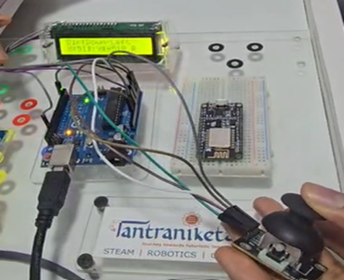
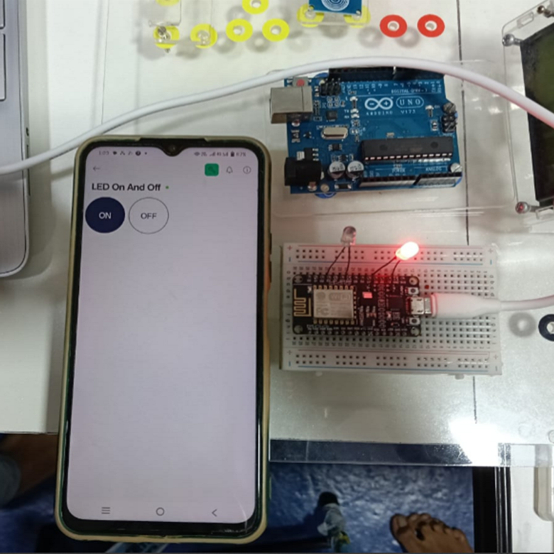

I gained practical experience with Git and GitHub, essential tools for source code management. I started by learning how to create and navigate project folders through basic terminal commands. Using git init, I was able to initialize a local repository, which allowed me to begin tracking changes. I understood how to stage files using git add and monitor their status through git status. Committing changes with meaningful messages using git commit -m helped me record specific versions of my code. I also linked my local project to a GitHub repository using git remote add origin and set the main branch using git branch -M. Finally, I pushed the committed files to the remote repository using git push origin. Overall, this session helped me understand how to manage code history, collaborate on projects, and maintain a structured workflow using Git and GitHub.

